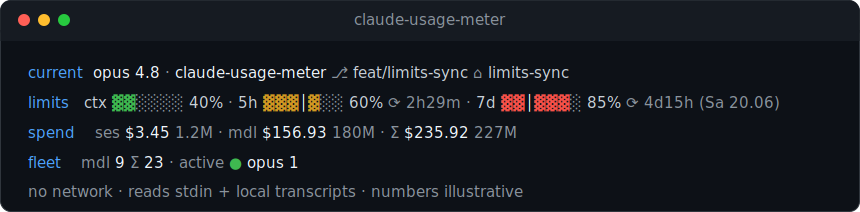

# claude-usage-meter

[](https://github.com/dezeat/claude-usage-meter/actions/workflows/ci.yml)
[](LICENSE)
[](package.json)

A [Claude Code](https://code.claude.com) plugin that surfaces your usage at a
glance — without making a single network call.

- **Live four-row statusline** — the active model + where you're rooted
  (repo ⎇ branch), account limits with pace bars, cost-forward spend, and a
  cross-session fleet view.
- **After-task cost summary** — a per-model token and dollar breakdown printed
  when a task finishes (a `Stop` hook).
- **Off-session report** — a retrospective CLI dashboard across every project
  session.

It reads only the statusline payload Claude Code pipes in on stdin and your
local session transcripts under `~/.claude/projects`. **No network, no
telemetry, zero runtime dependencies** — just the Node built-in `node:sqlite`.



> Numbers are illustrative. Colour: **bright** = live / headline value, dim =
> idle / accumulated / chrome, the row label is accent-coloured, a green ● marks
> a live session, and bars run green → yellow → red by fill. `NO_COLOR` is
> honoured — every glyph and the layout survive, only the hue layer is dropped.

## What each row shows

| Row         | Reading                                                                                                                                                                                                                                                                                                                                                                                                                                                                                                                 |
| :---------- | :---------------------------------------------------------------------------------------------------------------------------------------------------------------------------------------------------------------------------------------------------------------------------------------------------------------------------------------------------------------------------------------------------------------------------------------------------------------------------------------------------------------------- |
| **current** | The active **model + version** (lowercased, `opus 4.8`) and **where the session is rooted** — the repo name and git **branch** after a `⎇`, then the **worktree** name after a `⌂` when the session sits in a linked git worktree (so two worktrees of one repo are distinguishable). Outside a git repo it shows the directory basename with no branch; resolved locally from `.git`, never a subprocess. The model lives here, so the rows below it use a neutral `mdl` self-tag instead of repeating the class name. |
| **limits**  | Account-wide context + 5-hour + 7-day usage bars with reset countdowns; the **7-day** reset also spells out its absolute day (`⟳ 4d21h (Tue 16.06)`). Bars colour by flat fill %; the bright `│` is the even-pace tick on the 5h/7d bars (where usage _should_ be for an even burn), and it never drives colour. No model here — it leads the `current` row above; limits are account-wide.                                                                                                                             |
| **spend**   | Cost-forward: **`$` leads, tokens trail dim**. This **session** (live), **this model** (`mdl`) this month, and **`Σ`**, the month total across every class.                                                                                                                                                                                                                                                                                                                                                             |
| **fleet**   | **This model** (`mdl`), its sessions **this month**, a dim `Σ`, then the **month total** across every class (`9 Σ 23`), then **`active`** — other sessions live right now per class (named by their real class, the row's one exception to `mdl`), **excluding the one you're in**. A green `●` leads each live class; the cell is dropped when nothing else is live.                                                                                                                                                   |

### Glyphs

| Glyph | Meaning                                                                       |
| :---- | :---------------------------------------------------------------------------- |
| `▓ ░` | bar fill / empty                                                              |
| `│`   | bright even-pace tick; only inside a 5h/7d bar, never drives colour           |
| `·`   | faint field separator                                                         |
| `●`   | green live-now marker, leads each live class in `active`                      |
| `Σ`   | month total across every model class (spend `Σ` cell; fleet `N Σ total`)      |
| `⟳`   | resets in… (the 7d reset also spells out its absolute day, `Tue 16.06`)       |
| `⎇`   | git branch, on the `current` row (dropped outside a repo)                     |
| `⌂`   | linked git worktree name, on the `current` row (dropped in a normal checkout) |
| `mdl` | self-tag for the active model on the rows below `current` (it is named there) |

### Subagents

A subagent runs in its own transcript file (`isSidechain`) but is not a separate
user session, so it is accounted carefully:

- Its cost **rolls into the parent session's `ses` total** — the work it did
  counts toward the session that spawned it.
- In the **per-class spend cells** it is priced under the **subagent's own model
  class**, never relabelled to the parent's — a Haiku subagent under an Opus parent
  shows as Haiku spend, because that is what was billed.
- The **session counts** (`fleet`'s `N Σ total` and the live `active ●` tally)
  count only top-level sessions, so a subagent is never tallied as one of your
  sessions.

A consequence worth expecting: the fleet count can show `0` haiku _sessions_ while
the spend row shows nonzero haiku _spend_ — a subagent produced Haiku cost without
being a session. That is correct, not a bug.

It **degrades cleanly**: the `current` row shows the model alone when the working
dir is unknown, the directory basename when outside a git repo, and is dropped
when neither model nor location is known; with no `rate_limits` in the payload
(for example on an API-billing account) the `limits` row is just `ctx`; with no
index yet the `spend` row is cost-only and `fleet` is dropped. A field never
renders half-empty, and the line never errors.

## How spend & fleet are computed

The numbers are auditable — every figure comes from your own transcripts and a
hand-maintained price table, with **no network call**. For the moving parts at a
glance, see the [architecture map](https://github.com/dezeat/claude-usage-meter/discussions/46)
(the pure-core / I-O-edge split and the three data flows).

### Spend

- **`ses` (this session)** is the session transcript aggregated by `aggregate.ts`
  into per-model token counts — input, output, cache-read, cache-create — deduped
  by `message.id + requestId` exactly as [ccusage](https://github.com/ryoppippi/ccusage)
  does, so a resumed or retried turn is never double-counted. Those tokens are
  priced by the hand-maintained `pricing.ts` table (dateless aliases; a
  `-YYYYMMDD` snapshot prices the same as its alias).
- **`mdl` this month** and the **`Σ` total** come from the cross-session
  `node:sqlite` index: one row per session carrying its priced cost and model
  class, rolled up per class for the active model and summed across **every**
  class for `Σ`.
- **Two cost sources, one rule.** Claude Code's payload carries its own running
  `cost.total_cost_usd`; the index carries the **price-table calc** over the
  aggregated tokens. The payload figure is authoritative for the **live,
  not-yet-indexed** session (the `ses` cell falls back to it before the store
  catches up); the price-table calc is authoritative for everything **persisted**
  — cross-session, month, `Σ`, and the report. A model the table doesn't know
  costs `$0`, is flagged `⚠`, and is **excluded** from the total — a price is
  never guessed.
- **Why the dollar figure looks low for the token count:** agentic usage is
  dominated by **cache reads**, billed ~50× cheaper than output, so total cost
  sits far below `tokens × output-rate`. The **report CLI** and the **`Stop`
  summary** print the four-way input / output / cache-read / cache-create split
  with a cache-read share (e.g. `96% cache reads`) so the number is legible, not
  surprising.

### Fleet

- **`mdl <count> Σ <total>`** counts **sessions this month** per model class from
  the index, plus the grand total across classes. Only **top-level** sessions are
  counted.
- **`active ●`** tallies sessions live **right now** — `lastTs` within the
  liveness window (`LIVENESS_WINDOW_MS`, 5 minutes) — per class, **excluding the
  session you're in**, so it reads as "besides you." The cell vanishes when
  nothing else is live.
- **Subagents are attributed, not counted.** A subagent runs in its own
  transcript (`isSidechain`) and gets its own index row, but its spend **rolls
  into the parent session's `ses`** and is priced under the **subagent's own**
  model class — never relabelled to the parent's
  ([ADR-0001](docs/decisions/ADR-0001-subagent-row-per-file.md),
  [ADR-0002](docs/decisions/ADR-0002-subagent-spend-follows-real-model.md)). It is
  **never tallied as a session**. This is why the counts and the spend can
  legitimately diverge — `0` haiku _sessions_ alongside nonzero haiku _spend_ is
  correct, not a bug.

## Requirements

- **Node.js ≥ 22.13** — the only hard floor. The cross-session store uses the
  built-in [`node:sqlite`](https://nodejs.org/api/sqlite.html) module, available
  without a flag since 22.13 (23.4 on the current line). There is **no
  `better-sqlite3`** and no native build
  step; zero runtime dependencies is a design goal.
- Claude Code (the statusline integration uses the `rate_limits` payload and the
  `refreshInterval` setting).

## Install

The statusline is the main feature, and **a Claude Code plugin cannot register
the top-level `statusLine`** — that is always a user `settings.json` setting. So
the most robust setup is to **clone to a stable path** and point your settings at
it. The committed `dist/` means a clone is runnable immediately — no build step.

### 1. Clone (runnable as-is)

```bash
git clone https://github.com/dezeat/claude-usage-meter.git \
  ~/.claude/tools/claude-usage-meter
```

### 2. Wire the statusline

Add to `~/.claude/settings.json` (or a project `.claude/settings.json`), using
the **absolute** path to your clone:

```json
{
  "statusLine": {
    "type": "command",
    "command": "node /home/you/.claude/tools/claude-usage-meter/dist/statusline.js 2>/dev/null",
    "refreshInterval": 10
  }
}
```

- `2>/dev/null` suppresses Node's `ExperimentalWarning` for `node:sqlite` so it
  never leaks into the line.
- `refreshInterval` (seconds; default `10`, minimum `1`) re-runs the command on a
  fixed idle timer _in addition_ to Claude Code's events, so the reset
  countdowns and live fleet counts keep ticking while you read or think. It runs
  locally over your own transcripts, so **refreshing costs no API tokens**, and
  an idle tick where no transcript has grown skips the index write entirely.

### 3. (Optional) Enable the `Stop` hooks

Two hooks fire when a task finishes:

- **`summary-hook.js`** prints the per-model cost summary for the task that just
  ended.
- **`index-hook.js`** writes _this_ session to the cross-session store on every
  turn-end (a targeted, event-driven write — see
  [ADR-0003](docs/decisions/ADR-0003-event-write-targeted-stop-hook.md)), so other
  live sessions' `fleet` rows see it on their next refresh — even when this
  session's statusline isn't ticking or isn't installed. Each hook is
  failure-isolated and never blocks the turn.

Either load the plugin for a session (registers both):

```bash
claude --plugin-dir ~/.claude/tools/claude-usage-meter
```

…or persist them in `~/.claude/settings.json`:

```json
{
  "hooks": {
    "Stop": [
      {
        "hooks": [
          {
            "type": "command",
            "command": "node /home/you/.claude/tools/claude-usage-meter/dist/summary-hook.js"
          }
        ]
      },
      {
        "hooks": [
          {
            "type": "command",
            "command": "node /home/you/.claude/tools/claude-usage-meter/dist/index-hook.js"
          }
        ]
      }
    ]
  }
}
```

### Install via the plugin marketplace

This repo is also a single-plugin marketplace. Installing this way activates both
`Stop` hooks automatically — the **after-task summary** and the **per-session
self-persist** that keeps other sessions' fleet views fresh:

```text
/plugin marketplace add dezeat/claude-usage-meter
/plugin install claude-usage-meter@dezeat
```

The **statusline still needs the manual `settings.json` step above** (a plugin
cannot register a `statusLine`, and the marketplace cache path changes on every
update, so it is not a stable target). For the statusline, prefer the clone
install.

## Off-session report

A retrospective usage report across all project sessions:

```bash
npm run report
# or, from anywhere:
node ~/.claude/tools/claude-usage-meter/dist/report-cli.js
```

Output: per-day usage with a token sparkline, per-model-class totals, per-branch
totals, and a billing-period total.

## Where your data lives

The cross-session index is a single SQLite file at
`~/.claude/usage-meter/index.db`, built incrementally from the transcripts under
`~/.claude/projects`. It is written two ways, both local and both idempotent: the
statusline sweeps every project on each refresh, and the `Stop` `index-hook`
self-persists the current session (including its subagents) on every turn-end. Each
transcript file is one row keyed by byte offset, so a line is counted exactly once
no matter which path writes it. Nothing leaves your machine. Delete the file to
reset it; it is rebuilt on the next run.

## Pricing

Costs come from a **hand-maintained pricing table** in
[`src/pricing.ts`](src/pricing.ts) (zero-network is the point) with a visible
`asOf` date. Unknown model ids cost `0`, are flagged, and are excluded from the
total rather than guessed — so an unpriced model never silently misstates the
figure. **Prices drift; PRs that update the table (and bump `asOf`) are
welcome** — see [CONTRIBUTING](CONTRIBUTING.md).

## Develop

```bash
npm install      # dev-only: typescript, eslint, prettier, husky
npm run check    # typecheck + lint + format check + build + tests
```

- `npm run build` compiles `src/` → `dist/` (runtime only; this is the committed,
  shipped artifact).
- `npm test` compiles to `dist-test/` (git-ignored, includes tests) and runs them
  with the Node built-in test runner.
- `claude plugin validate . --strict` validates the plugin + marketplace
  manifests.

Tests follow the source's red-green discipline; fixture expectations come from an
external oracle, never from running the implementation under test.

## License

[MIT](LICENSE) © dezeat
