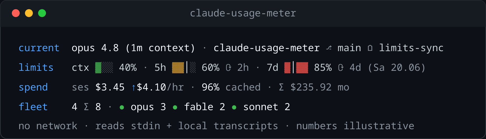

# claude-usage-meter

[](https://github.com/dezeat/claude-usage-meter/actions/workflows/ci.yml)
[](LICENSE)
[](package.json)

A [Claude Code](https://code.claude.com) plugin that turns usage and cost into a
**live statusline cockpit** — one glance shows the running model, where you're
rooted, your account limits, live spend, and every parallel session across your
worktrees.

**No network, no telemetry, zero runtime dependencies.** Every figure is computed
locally, from:

- the statusline payload Claude Code pipes in on **stdin**;
- your local session transcripts under `~/.claude/projects`;
- a cross-session index persisted in the Node built-in **`node:sqlite`**.

Nothing ever leaves your machine.



The default look is a **four-row block**, each row a self-contained readout:

- **current** — the active model and where you're rooted (repo · branch · worktree).
- **limits** — context, 5-hour and 7-day account usage as short pace bars with
  reset countdowns.
- **spend** — cost-forward: this session's cost, a live burn rate, the cache-read
  share, and the month total.
- **fleet** — how many sessions you've run this month, and who else is live right
  now.

Fields and row-groups are separated by a dim `·`, and each row label is
accent-coloured.

**Prefer one line?** A single-line **HUD** is one env var away
(`USAGE_METER_LAYOUT=line`, [Layout & meters](#layout--meters)). It folds the same
fields onto **one line that never wraps** — it reads the terminal width from
`COLUMNS` and sheds low-priority fields by a fixed order until the line fits, so a
narrow prompt degrades gracefully instead of spilling onto a second row. To stay
compact it abbreviates (the roster to `●o(3)`, the cache share to `96%c`). Renders
of the HUD and the pill meters live in [`assets/`](assets/).

### Three views over the same local data

- a **live statusline** (above), redrawn on Claude Code's `refreshInterval`;
- an **after-task cost summary** — a per-model token and dollar breakdown printed
  when a task finishes (a `Stop` hook);
- an **off-session report** — a retrospective CLI dashboard across every project
  session.

**Why this and not [ccusage](https://github.com/ryoppippi/ccusage)?** ccusage is
an excellent off-line CLI report; this is the complementary piece — a _live_
statusline you read while you work, built for parallel worktree sessions, with a
cross-session fleet view that names the other models running right now. Same
zero-network, local-transcript accounting (it dedupes exactly as ccusage does),
different cadence. Run both.

## What each row shows

**current** — the active model and where the session is rooted:

- **Model + version**, lowercased (`opus 4.8`). It leads the line, so the rows
  below never repeat the class name.
- **Repo and git branch** after a `⎇`, then the **working tree** after a `⌂` —
  `root` for the main checkout, the linked-worktree name inside one — so you
  always know which of several parallel sessions this is.
- Outside a git repo it shows the directory basename with no branch. Resolved
  locally from `.git`, never a subprocess.

**limits** — account-wide, no model (it leads `current` above):

- **Context + 5-hour + 7-day** usage as three short bars (`▓` filled, `░` empty);
  the **percentage beside each bar carries the precision** the coarse three-cell
  bar gives up. Reset countdowns follow after `⟳`, shown as the largest unit only
  (`2h`, `4d`); the **7-day** reset also spells out its absolute day
  (`⟳ 4d (Sa 20.06)`).
- Bars colour by flat fill %. The bright `│` is the **even-pace tick** on the
  5h/7d bars (where usage _should_ be for an even burn); it never drives colour,
  and it is a pace marker, **not** a field separator.
- Swap `USAGE_METER_METERS=pill` and each bar becomes a reverse-video severity
  **pill** — the same green → yellow → red ramp as a compact chip.

**spend** — cost-forward, live figures bright:

- **`ses`** — this **session**, live: the cost, then a burn rate after an accent
  `↑` (`$4.10/hr`) whenever a duration is known.
- **Cache-read share** — `96%c` in the HUD, `96% cached` in the block layout: the
  fraction of tokens served from cache. It is the one cue that explains a
  surprisingly-low cost — agentic usage is cache-read-dominated, and a cache read
  is far cheaper than fresh output.
- **`Σ … mo`** — the dim month ledger, the total cost across every class this
  month, the single accumulated figure worth a glance on the live line. Per-class
  month costs are reference-cadence detail, served by the
  [off-session report](#off-session-report).

**fleet** — session counts first, then who else is live (e.g. `4 Σ 8`):

- **`<n> Σ <total>`** — the active class's sessions **this month**, a dim `Σ`
  connective, then the **month total** across every class. The `current` row
  already names the active model, so this count cell carries no self-tag.
- **Live roster** — `● <class> <n> …`, the other sessions live right now per
  class, named by their real class and **excluding the one you're in**. A green
  `●` leads each live class; the roster is dropped when nothing else is live. The
  `block` layout spells the class out (`● opus 3`); the single-line HUD abbreviates
  it to the class initial with the count in parens (`●o(3)`) to stay on one line.
  Live status is heartbeat-first, with transcript activity as a fallback for
  legacy rows; the default 30-second window spans three default refresh ticks.

### Subagents

A subagent runs in its own transcript file (`isSidechain`) but is not a separate
user session, so it is accounted carefully:

- Its cost **rolls into the parent session's `ses` total**.
- In the **per-class breakdowns** (report CLI, `Stop` summary) it is priced under
  the **subagent's own model class**, never relabelled — a Haiku subagent under an
  Opus parent shows as Haiku spend, because that is what was billed.
- The **session counts** (`fleet`'s `<n> Σ <total>` and the live `●` roster)
  include only top-level sessions, so a subagent is never tallied as one.

So the fleet count can show `0` haiku _sessions_ alongside nonzero haiku _spend_ —
a subagent produced Haiku cost without being a session. Correct, not a bug.

It **degrades cleanly.** The `current` row shows the model alone when the working
dir is unknown, the directory basename outside a git repo, and is dropped when
neither model nor location is known. With no `rate_limits` in the payload (e.g. an
API-billing account) the `limits` row is just `ctx`; with no index yet `spend` is
cost-only and `fleet` is dropped. A field never renders half-empty, and the line
never errors.

## How spend & fleet are computed

Every figure is auditable — it comes from your own transcripts and a
hand-maintained price table, with **no network call**. The
[architecture map](https://github.com/dezeat/claude-usage-meter/discussions/46)
covers the moving parts (pure-core / I-O-edge split, three data flows).

- **`ses` tokens** are aggregated by `aggregate.ts` (input / output / cache-read /
  cache-create) and deduped by `message.id + requestId` exactly as
  [ccusage](https://github.com/ryoppippi/ccusage) does, so a resumed or retried
  turn is never double-counted, then priced by the `pricing.ts` table (dateless
  aliases; a `-YYYYMMDD` snapshot prices as its alias).
- **The `Σ` month total and the fleet counts** come from the cross-session
  `node:sqlite` index — one row per **top-level** session carrying its priced cost
  and model class. The live `●` roster uses each row's latest heartbeat, falling
  back to `lastTs` for a legacy row without one. Its default 30-second liveness
  window is three 10-second refresh ticks. The current session and subagent rows
  are always excluded.
- **Two cost sources, one rule.** The payload's running `cost.total_cost_usd` is
  authoritative for the **live, not-yet-indexed** session (the `ses` cell falls
  back to it); the index's price-table calc is authoritative for everything
  **persisted**. An unknown model costs `$0`, is flagged `⚠`, and is **excluded**
  from the total — never guessed.
- **Why the dollars look low for the token count:** agentic usage is dominated by
  **cache reads**, billed ~50× cheaper than output, so total cost sits far below
  `tokens × output-rate`. The **report CLI** and **`Stop` summary** print the
  four-way split with a cache-read share (e.g. `96% cache reads`) so it is legible.
- **Subagents are attributed, not counted** (see [Subagents](#subagents) above):
  each gets its own index row but is **never tallied as a session**, while its
  spend rolls into the parent's `ses` under its own class
  ([ADR-0001](docs/decisions/ADR-0001-subagent-row-per-file.md),
  [ADR-0002](docs/decisions/ADR-0002-subagent-spend-follows-real-model.md)).

## Requirements

- **Node.js ≥ 22.13** — the only hard floor. The cross-session store uses the
  built-in [`node:sqlite`](https://nodejs.org/api/sqlite.html) module, available
  without a flag since 22.13. There is **no `better-sqlite3`** and no native build
  step; zero runtime dependencies is a design goal.
- **Claude Code** — the statusline uses the `rate_limits` payload and the
  `refreshInterval` setting.

## Install

Two parts: the **`Stop` hooks** (after-task summary + cross-session self-persist)
and the **statusline**. A Claude Code plugin can register the hooks but **not the
top-level `statusLine`** — that is always a user `settings.json` setting — so the
statusline is wired manually in both paths below.

### Recommended: plugin marketplace + manual statusline

This repo is a single-plugin marketplace. Installing it activates both `Stop`
hooks automatically:

```text
/plugin marketplace add dezeat/claude-usage-meter
/plugin install claude-usage-meter@dezeat
```

Then wire the statusline. The marketplace cache path changes on every update, so
**clone to a stable path** for the statusline and point `settings.json` at it
(the committed `dist/` is runnable immediately — no build step):

```bash
git clone https://github.com/dezeat/claude-usage-meter.git \
  ~/.claude/tools/claude-usage-meter
```

Add to `~/.claude/settings.json` (or a project `.claude/settings.json`), using
the **absolute** path to your clone:

```json
{
  "statusLine": {
    "type": "command",
    "command": "node /home/you/.claude/tools/claude-usage-meter/dist/statusline.js 2>/dev/null",
    "refreshInterval": 10
  }
}
```

- `2>/dev/null` suppresses Node's `ExperimentalWarning` for `node:sqlite` so it
  never leaks into the line.
- `refreshInterval` (seconds; default `10`, minimum `1`) re-runs the command on a
  fixed idle timer _in addition_ to Claude Code's events, so reset countdowns and
  live fleet counts keep ticking while you read. It runs locally over your own
  transcripts, so **refreshing costs no API tokens**. A quiet tick skips
  transcript folding and cross-project sweep upserts, but still performs one
  narrow heartbeat write; an account-limit observation in the payload may also
  be persisted.
- If you set a custom `refreshInterval`, you must mirror it in the command
  environment as `USAGE_METER_REFRESH_INTERVAL=<seconds>` — for example,
  `USAGE_METER_REFRESH_INTERVAL=5` alongside `"refreshInterval": 5`. This keeps
  the live window at three refresh ticks.

### Layout & meters

The statusline has two orthogonal presentation toggles, read from environment
variables set inline in the `command` exactly like `NO_COLOR`
([ADR-0007](docs/decisions/ADR-0007-statusline-layout-and-meter-toggles.md)):

- **`USAGE_METER_LAYOUT`** — `block` (**default**, the four stacked rows) or `line`
  (the single-line HUD).
- **`USAGE_METER_METERS`** — `bar` (**default**, short pace bars) or `pill`
  (reverse-video severity chips; degrades to bracketed text `[85%]` under
  `NO_COLOR`).

They compose into four looks; an unrecognized value falls back to the default and
never throws. Renders of each — the `line` HUD and the `pill` meters — live in
[`assets/`](assets/). To pin one, set the env vars inline in the `command`:

```json
{
  "statusLine": {
    "type": "command",
    "command": "USAGE_METER_LAYOUT=block USAGE_METER_METERS=pill node /home/you/.claude/tools/claude-usage-meter/dist/statusline.js 2>/dev/null",
    "refreshInterval": 10
  }
}
```

The `line` HUD guarantees it never wraps by reading the terminal width from
`COLUMNS` — Claude Code sets it (v2.1.153+); absent, it falls back to `80`
columns.

### Manual hooks (clone-only, no marketplace)

If you skip the marketplace, register the two `Stop` hooks yourself.
**`summary-hook.js`** prints the per-model cost summary when a task finishes;
**`index-hook.js`** self-persists _this_ session on every turn-end (a targeted,
event-driven write — see
[ADR-0003](docs/decisions/ADR-0003-event-write-targeted-stop-hook.md)) so other
live sessions' `fleet` rows see it on their next refresh. Each hook is
failure-isolated and never blocks the turn.

Load the plugin per session:

```bash
claude --plugin-dir ~/.claude/tools/claude-usage-meter
```

…or persist them in `~/.claude/settings.json`:

```json
{
  "hooks": {
    "Stop": [
      {
        "hooks": [
          {
            "type": "command",
            "command": "node /home/you/.claude/tools/claude-usage-meter/dist/summary-hook.js"
          }
        ]
      },
      {
        "hooks": [
          {
            "type": "command",
            "command": "node /home/you/.claude/tools/claude-usage-meter/dist/index-hook.js"
          }
        ]
      }
    ]
  }
}
```

## Off-session report

A retrospective dashboard across all project sessions — per-day usage with a token
sparkline, per-model-class and per-branch totals, and a billing-period total:

```bash
npm run report
# or, from anywhere:
node ~/.claude/tools/claude-usage-meter/dist/report-cli.js
```

## How it stays live and in sync

The statusline is **pull-only** — no background daemon, no network. Every render is
a fresh, short-lived process: Claude Code re-runs the command on its
`refreshInterval` (and on events), and each tick reads the stdin payload, any grown
transcripts, and the shared index, draws the line, and exits. It runs entirely over
local files, so **refreshing costs no API tokens**.

Parallel sessions never talk to each other — they meet in the shared local index.
Each session persists **its own** row (priced cost + model class) and writes a small
**heartbeat** every tick; every other session's next refresh reads the whole index,
so its `fleet` roster and `Σ` month total reflect every session sharing that index —
all your parallel worktrees — within a tick or two.

**Liveness is a time window, and that's a deliberate, revisable choice.** "Live
right now" today means _wrote a heartbeat in the last 30 seconds_ (three default
refresh ticks), so a session must keep ticking to stay in the roster — which makes
freshness and per-session cost the same dial
([ADR-0008](docs/decisions/ADR-0008-refresh-heartbeat-defines-live-sessions.md)). A
PID-based alternative — probe the stored process instead of requiring a heartbeat,
decoupling liveness from tick cadence — is spiked and **deferred**
([Discussion #131](https://github.com/dezeat/claude-usage-meter/discussions/131)).

## Where your data lives

The cross-session index is a single SQLite file at
`~/.claude/usage-meter/index.db`, built incrementally from the transcripts under
`~/.claude/projects`.

- **Written two local, idempotent ways** — the statusline sends a narrow heartbeat
  each refresh and incrementally sweeps projects when transcripts change; the
  `Stop` `index-hook` self-persists the current session (with its subagents) on
  every turn-end.
- **Exactly-once accounting** — each transcript is one row keyed by byte offset,
  so a line counts once no matter which path writes it.
- **Yours to reset** — nothing leaves your machine; delete the file and it
  rebuilds on the next run.

**The line is a glance; the full detail is retained.** Each session is stored
whole — one row keeps:

- the **four-way token split** — input / output / cache-read / cache-create —
  **per model id**;
- the priced **cost**, **model class**, and **git branch**;
- the **month**, **last-activity timestamp**, and **machine id**;
- the **subagent→parent** link.

The statusline shows a compact summary of this; the
[off-session report](#off-session-report) prints the full breakdown, and the
[**multi-layer drill-down analysis**](#roadmap) over the same data is on the
roadmap.

## Pricing

Costs come from a **hand-maintained pricing table** in
[`src/pricing.ts`](src/pricing.ts) (zero-network is the point) with a visible
`asOf` date; unknown ids are flagged and excluded rather than guessed. **Prices
drift; PRs that update the table (and bump `asOf`) are welcome** — see
[CONTRIBUTING](CONTRIBUTING.md).

## Roadmap

Work is tracked as issues on the
[project board](https://github.com/dezeat/claude-usage-meter/issues). Everything
below stays true to the core principle — **local-only, zero runtime deps, no
network.**

- **[Multi-layer drill-down analysis](https://github.com/dezeat/claude-usage-meter/issues/103)**
  (epic) — pivot and drill the retained per-session data across time → project →
  model → session → token-kind, with cost and cache-read efficiency at every
  layer. Two presentations over one shared pure rollup engine
  ([#104](https://github.com/dezeat/claude-usage-meter/issues/104)): a `--group-by`
  **CLI tree** ([#105](https://github.com/dezeat/claude-usage-meter/issues/105))
  and a **self-contained HTML dashboard** export
  ([#106](https://github.com/dezeat/claude-usage-meter/issues/106)) — one portable
  file, no served app.
- **[Live burn-rate windowing](https://github.com/dezeat/claude-usage-meter/issues/101)**
  — a true windowed spend rate and velocity sparklines, from a persisted sample
  ring.
- **[Leaner block/HUD internals](https://github.com/dezeat/claude-usage-meter/issues/102)**
  — one segment builder per row, so the two layouts can't drift.

Have an idea? Open an issue — and pricing PRs (update the table, bump `asOf`) are
always welcome.

## Develop

```bash
npm install      # dev-only: typescript, oxlint, prettier, husky
npm run check    # typecheck + lint + format check + build + tests
```

- `npm run build` compiles `src/` → `dist/` (the committed, shipped artifact);
  `npm test` compiles to `dist-test/` (git-ignored) and runs the Node test runner.
  Tests follow a red-green discipline; expectations come from an external oracle,
  never from the implementation.
- `claude plugin validate . --strict` validates the plugin + marketplace manifests.
- **Architecture** — the pure-core / I-O-edge split and data flows are mapped in
  [docs/architecture.md](docs/architecture.md).

## License

[MIT](LICENSE) © dezeat
