# Architecture

A [C4-model](https://c4model.com/) view of **claude-usage-meter** — a Claude Code
plugin that surfaces usage and cost **without a single network call**. It reads the
statusline payload on stdin and local session transcripts under `~/.claude/projects`,
and persists a cross-session index in `node:sqlite`.

The graph is **derived from the actual `import` graph in `src/`**, not memory, and it
makes legible the two invariants the architecture rests on:

- the **pure-core / I-O-edge split**, and
- the **anti-corruption boundary** (`payload.ts` / `aggregate.ts`).

> **Long-form home:** the rationale, debate, and history live in
> [Discussion #46](https://github.com/dezeat/claude-usage-meter/discussions/46)
> (`Design`). This page is the in-repo, release-facing snapshot; regenerate it with
> the [`architecture-diagram`](../.claude/skills/architecture-diagram/SKILL.md) skill.

## The map

<!-- Rendered hand-drawn (mermaid look: handDrawn — rough.js, the engine Excalidraw uses). -->
<!-- Regenerate via the architecture-diagram skill; the fenced block below is the source of truth. -->

Mermaid source (renders natively on GitHub)

```mermaid
---
config:
  look: handDrawn
  theme: neutral
---
flowchart TB
  %% C4 model of claude-usage-meter — derived from the actual src/ import graph.

  %% ── Level 1 · System Context ─────────────────────────────────────────────
  CC([Claude Code<br/>host CLI])
  OP([Operator<br/>off-session])
  TR[("~/.claude/projects/**.jsonl<br/>session transcripts · Claude Code writes")]
  IDX[("~/.claude/usage-meter/index.db<br/>node:sqlite · 1 row per session")]

  subgraph SYS["claude-usage-meter — a Claude Code plugin · no network · zero runtime deps"]
    direction TB

    %% ── Level 2 · Containers (process entry points) ───────────────────────
    subgraph EDGES["I/O edges — own stdin · filesystem · node:sqlite"]
      direction TB
      SL["statusline.ts<br/>live 3-row statusline"]
      SH["summary-hook.ts<br/>Stop-hook after-task summary"]
      IH["index-hook.ts<br/>Stop-hook event write"]
      RC["report-cli.ts<br/>off-session report"]
      IS["index-store.ts<br/>read transcripts · fold · write store"]
      DB["db.ts<br/>node:sqlite boundary · atomic upsert · WAL"]
      LOC["location.ts<br/>cwd → repo · branch · worktree"]
      STDIN["stdin.ts"]
    end

    %% ── Level 3 · Components (pure core) ──────────────────────────────────
    subgraph CORE["Pure core — values in → strings/numbers out · no clock · no fs · no process"]
      direction TB
      PAY["payload.ts ⟂ ACL"]
      AGG["aggregate.ts ⟂ ACL"]
      REN["render.ts"]
      FR["fleet-render.ts"]
      REP["report.ts"]
      SUM["summary.ts"]
      PRI["pricing.ts"]
      BARS["bars.ts"]
      FMT["format.ts"]
      ANSI["ansi.ts"]
    end
  end

  %% ── Flow 1 · live statusline (refreshInterval) ───────────────────────────
  CC -- "payload (stdin JSON)" --> SL
  SL --> STDIN
  SL -- "narrow unknown → ParsedPayload" --> PAY
  SL -- "cwd → location" --> LOC
  SL -- "updateIndex" --> IS
  SL --> REN
  REN --> FR
  REN --> BARS
  REN ==> OUT1["3-row statusline (stdout)"]

  %% ── Flow 2 · after-task summary + event write (Stop hook) ────────────────
  CC -- "writes" --> TR
  CC -- "Stop hook" --> SH
  CC -- "Stop hook" --> IH
  SH -- "reads just-finished transcript" --> TR
  SH --> AGG
  AGG --> SUM
  SUM ==> OUT2["after-task summary (stdout)"]
  IH --> IS

  %% ── Flow 3 · off-session report ──────────────────────────────────────────
  OP -- "runs report" --> RC
  RC --> IS
  RC --> REP
  REP ==> OUT3["report dashboard (stdout)"]

  %% ── Shared persistence + pricing ─────────────────────────────────────────
  IS -- "read incrementally" --> TR
  IS -- "fold lines → ModelUsage" --> AGG
  IS <--> DB
  DB <--> IDX
  IS -- "CrossSessionIndex" --> REN
  IS -- "CrossSessionIndex" --> REP
  PRI -. "priced by" .-> IS
  PRI -. "priced by" .-> SUM
  PRI -. "priced by" .-> RC
  REN --> ANSI
  REP --> FMT

  classDef edge fill:#0d3b66,stroke:#7aa7d8,color:#fff;
  classDef core fill:#1b4332,stroke:#74c69d,color:#fff;
  classDef acl fill:#5a3e1b,stroke:#e0a458,color:#fff,stroke-width:2px;
  classDef store fill:#3a3a3a,stroke:#aaa,color:#fff;
  class SL,SH,IH,RC,IS,DB,LOC,STDIN edge;
  class REN,FR,REP,SUM,PRI,BARS,FMT,ANSI core;
  class PAY,AGG acl;
  class TR,IDX store;
```

## How to read it (C4 levels + palette)

- **Level 1 · Context** — the rounded nodes are the people/systems _outside_ the
  plugin: **Claude Code** (the host CLI that pipes the payload and fires the Stop
  hook), the **Operator** (a human running the off-session report), and the two
  grey cylinders of on-disk state under `~/.claude` — the append-only **transcripts**
  Claude Code writes and our **`node:sqlite` index** (one row per session, atomic
  upsert, WAL).
- **Level 2 · Containers** — the two subgraphs inside `SYS` are the plugin's process
  surfaces: the **I/O edges** (the entry points `statusline.ts`, `summary-hook.ts`,
  `index-hook.ts`, `report-cli.ts` plus the store/IO helpers `index-store.ts`,
  `db.ts`, `location.ts`, `stdin.ts`) and the **pure core**.
- **Level 3 · Components** — the modules inside each container, with the dependency
  edges drawn from the real imports.

Colour carries the invariant:

- **Blue = I/O edge.** Owns stdin, the filesystem, and the SQLite store — every side
  effect lives here.
- **Green = pure core.** Data in, string/number out; no clock, no `fs`, no `process`
  — "now" is always a parameter. This is the line every test runs against with a
  fixed `nowMs`.
- **Amber ⟂ = the anti-corruption layer.** `payload.ts` (statusline payload) and
  `aggregate.ts` (transcript lines) are the _only_ places untrusted JSON becomes
  trusted domain types, via `unknown` + narrowing. They are the one place that types
  explicitly — and the one place that must **never throw** on bad input
  (skip-and-count, never crash the bar).
- **Grey cylinders = on-disk state**, both under `~/.claude`.

## The three data flows

1. **Live statusline** — Claude Code pipes the payload on **stdin**; `statusline.ts`
   narrows it through `payload.ts`, resolves the location off `.git` via
   `location.ts`, folds the cross-session `index` via `index-store.ts`, and hands
   pure values to `render.ts` → `fleet-render.ts`. Re-runs on `refreshInterval`, so
   every hop is cheap and total — a missing field shortens the line, never throws.
2. **After-task summary + event write** — on the **Stop hook**, `summary-hook.ts`
   aggregates the just-finished transcript (`aggregate.ts` → `summary.ts`) and prints
   the per-model cost/token breakdown; `index-hook.ts` persists that session's row
   through `index-store.ts` → `db.ts` (the event-driven write,
   [ADR-0003](decisions/ADR-0003-event-write-targeted-stop-hook.md)).
3. **Off-session report** — `report-cli.ts` reads the whole `node:sqlite` index via
   `index-store.ts` and renders the retrospective dashboard with `report.ts`.

## Where the SQLite index sits

`index-store.ts` is the **only** module that both reads transcripts and writes the
store; `db.ts` is the thin `node:sqlite` boundary (atomic upsert, WAL + retried WAL
switch). The index is **written** on the Stop event and refreshed on statusline
render, and **read back** by `render.ts` (fleet/spend cells) and `report.ts`
(dashboard) as a plain `CrossSessionIndex` value — the readers never touch SQLite.

## Subagent → parent attribution

A subagent runs in its **own transcript** (`isSidechain`) but is not a separate user
session. In the fold inside `index-store.ts` / `aggregate.ts`:

- its **cost rolls into the parent session's total**
  ([ADR-0002](decisions/ADR-0002-subagent-spend-follows-real-model.md): spend follows
  the real model that was billed — a Haiku subagent shows as Haiku spend, never
  relabelled to the parent's class), while
- the **session counts** count only top-level sessions, so a subagent is never tallied
  as a session ([ADR-0001](decisions/ADR-0001-subagent-row-per-file.md)).

This is why fleet _counts_ and _spend_ legitimately diverge (e.g. `0` haiku sessions
yet nonzero haiku spend) — the attribution rule, not a bug.

## On `location.ts` importing `render.ts`

The lone edge→core import is **type-only**: `location.ts` imports the `Location`
_interface_ declared in `render.ts`. No runtime dependency crosses the boundary the
wrong way — the edge produces the pure value type the core consumes.
